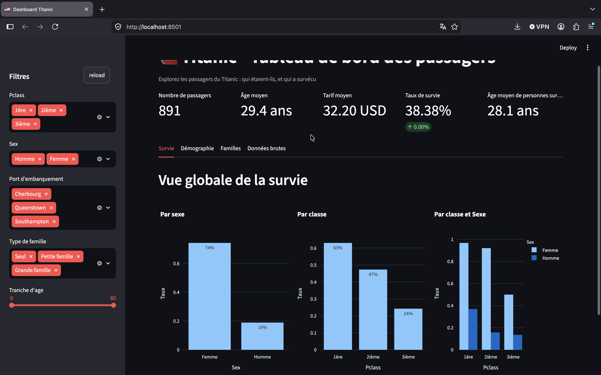
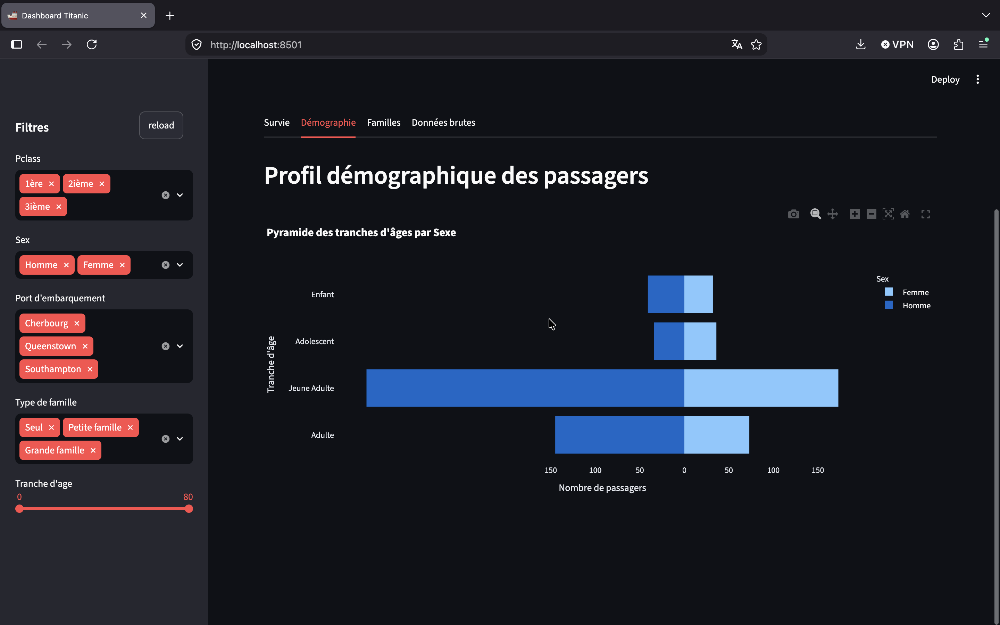
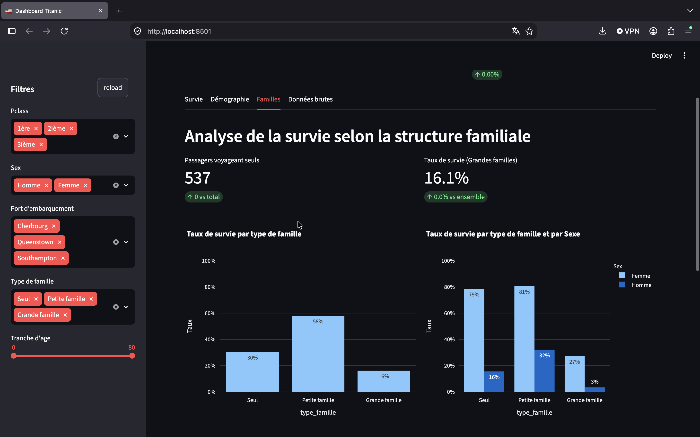
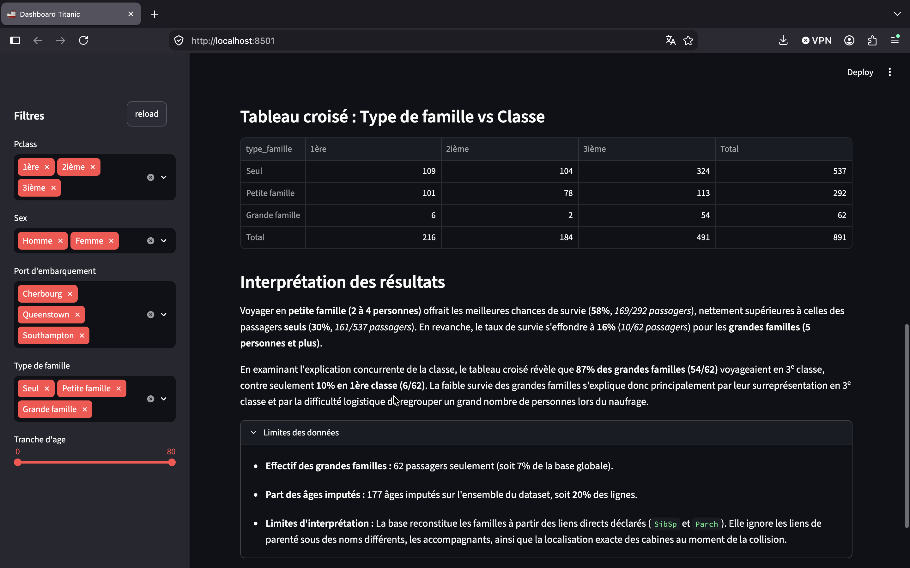
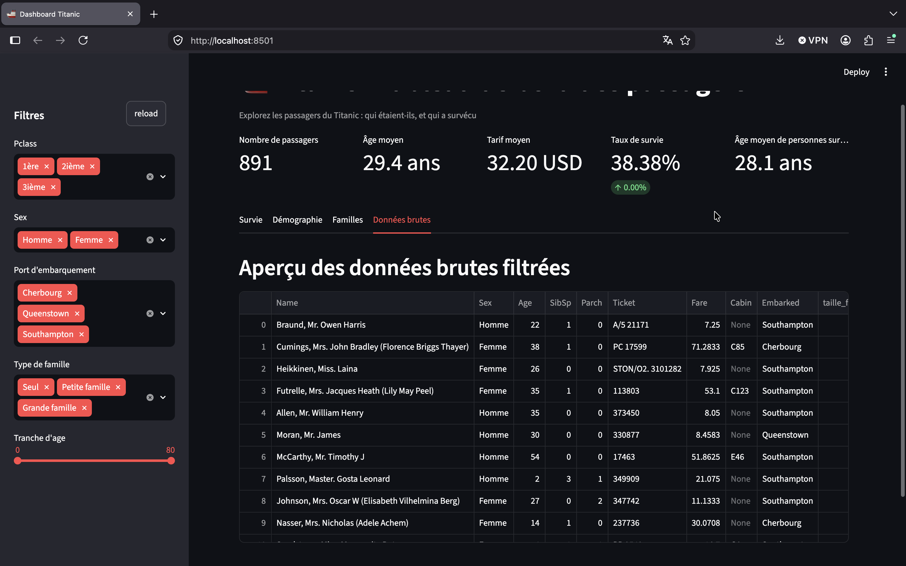

# Application BI Self-Service Titanic
**Etudiant : Salem Malick MOHAMED**

## 1. Description du projet
Cette application Streamlit prolonge le tableau de bord du cours sur le Titanic pour analyser l'impact de la structure familiale sur la survie des passagers.

## 2. Preparation des données et Imputation des Âges
- **Traitements réalisés :** Reconstitution de la taille de famille (`SibSp + Parch + 1`), catégorisation (`Seul`, `Petite famille`, `Grande famille`), normalisation des titres de civilité (`Mr`, `Mrs`, `Miss`, `Master`, `Autre`).
- **Nombre d'âges imputés :** **177 âges** (soit **20 %** de la base globale).

### Pourquoi privilégier la médiane par titre à la médiane globale ?
Le titre extrait du nom est un indicateur sociologique très précis de l'âge du passager. Par exemple, le titre `Master` identifie des garçons en bas âge (médiane de 3,5 ans), tandis que `Mr` identifie des hommes adultes (médiane de 30 ans). 

Si l'on appliquait la médiane globale (28 ans), on attribuerait un âge d'adulte à tous les enfants dont l'âge était non renseigné. L'imputation par titre évite ce biais et garantit une meilleure cohérence des données démographiques.

## 3. Petite amélioration
Rajout d'une fonction qui remet les filtres à zéro, pour faciliter l'exploration des données

## 4. Captures d'écran des résultats

- **Onglet Survie**



- **Onglet Démographie**



- **Onglet Famille**




- **Onglet Données brutes**




## 5. Lancement
```bash
streamlit run app.py